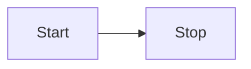

# Decision Trees

Decision trees are simple programs consisting of:
- A nested sequence of `if else` decisions based on the features.
- A class `label` as a return value at the end of each sequence.

Example of a decision tree:

```python
if milk > 0.5:
    return 'sick'
else:
    if egg > 1:
        return 'sick'
    else:
        return 'not sick'
```

You can draw sequences of decisions as a tree:
